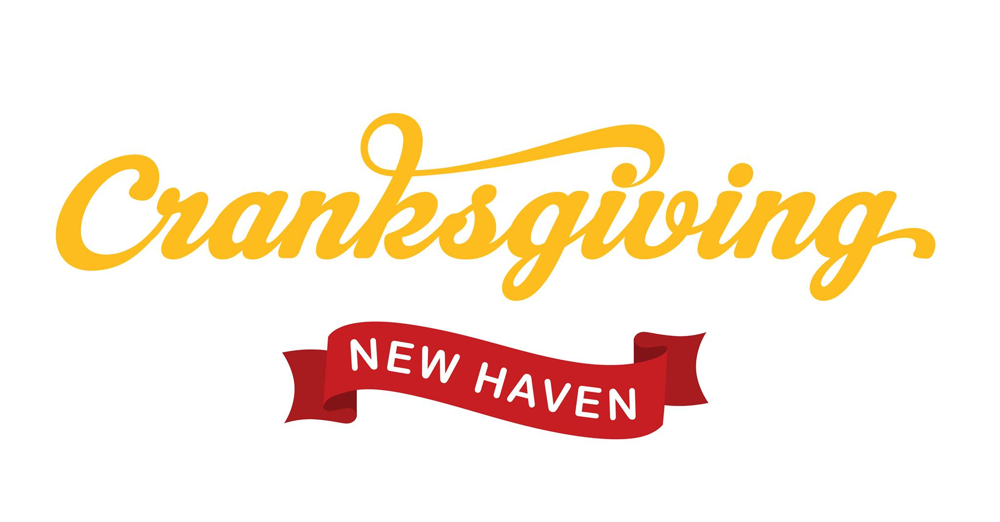

# Cranksgiving

## November 21, 11A-2P

### Rain date: November 28, 11A-2P

## What is this?

Cranksgiving is a food drive on two wheels. Part bike ride, part madcap scavenger hunt. All you need is a bicycle, a lock and a bag!

This event is FREE, but you'll need $15-$20 to purchase food. Donations will support Downtown Evening Soup Kitchen.

Bike out to Edge of the Woods and Stop and Shop to pick up non-perishables that will support DESK <https://www.deskct.org/>

Cranksgiving is a national event that occurs in over 100 cities across the United States and Canada. Visit <www.cranksgiving.org> for more locations.

## The ride

This is the current planned route: <https://ridewithgps.com/routes/37920358>

Please be aware that this is not final, but should give you an idea of the kind of ride to expect. The final route will be published by Saturday, 11/20/21.

## Healthy Foods Donation List

### Fruits:

- [ ]  **Canned fruit** (in 100% fruit juice or water)
- [ ]  **Applesauce**, unsweetened
- [ ]  **Dried fruit** (such as raisins & prunes
- [ ]  **100% fruit juice**

### Vegetables:

- [ ]  **Canned vegetables**, no salt added (sodium 140mg or less)
- [ ]  **Canned tomatoes**, no salt added (Sodium 140mg or less)
- [ ]  **Tomato sauce**, no salt added (Sodium 480mg or less, Sugar 8g or less)
- [ ]  **Spaghetti sauce**, low sodium (Sodium 480mg or less, Sugar 8g or less)
- [ ]  **Salsa** (Sodium 140mg or less)

### Combination Foods:

- [ ]  **Soups, stews or chili** (Sodium 480mg or less)
- [ ]  **Granola bars, chips**
- [ ]  **Broth or stock**, unsalted, (Sodium 140mg or less)

### Beverages:

- [ ]  **Tea bags**
- [ ]  **Coffee**
- [ ]  **Water, seltzer**, unsweetened

### Miscellaneous:

- [ ]  **Cat and cog food** (canned, small bags of dry, or large bags with 1-gallon zip-lock bags)

### Whole Grains:

- [ ]  **Brown rice, wild rice or quinoa**
- [ ]  **Whole grain or whole wheat pasta**
- [ ]  **Oatmeal or whole grain cream of wheat**, unflavored
- [ ]  **Whole grain crackers** (Fiber 3g or more)
- [ ]  **Whole wheat or corn tortillas**, non-refrigerated (Fiber 3g or more)
- [ ]  **Whole grain cereal** (Sugar 6g or less, Fiber 3g or more)
- [ ]  **Popcorn**, kernels or microwave 94% fat free

### Proteins:

- [ ]  **Canned beans, peas, lentils**, no salt added or low sodium (Sodium 140mg or less)
- [ ]  **Shelf stable boxed tofu**
- [ ]  **Dried beans, peas, lentils**
- [ ]  **Canned tuna, salmon, chicken or sardines** in water, low sodium
- [ ]  **Peanut butter**
- [ ]  **Nuts or seeds**, unsalted

### Condiments & Oils:

- [ ]  **Lite salad dressings**
- [ ]  **Vinegar**
- [ ]  **Vegetable, olive, or canola oil**
- [ ]  **Dried herbs and spices** (oregano, basil, cumin, chili powder, paprika)
- [ ]  **100% fruit spread**
- [ ]  **Garlic** (granulated, powdered, or mixed)

## A Word

Thank you to everyone at DESK CT!

DESK's mission:

"To serve people experiencing homelessness or living in poverty by providing food assistance and services that promote health, community, and equity."

<label class="container">One
  <input type="checkbox" checked="checked">
  
</label>
