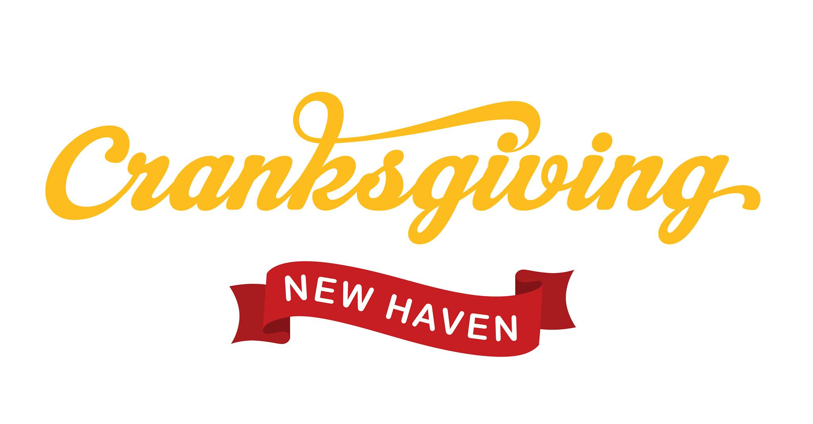

# Cranksgiving 2025

Cranksgiving is a food drive for charity on two wheels. Part bike ride, part scavenger hunt. All you need is a bicycle, a lock and a bag!

Cranksgiving New Haven will be taking place on Sunday, November 23.

Please plan to arrive at **11 AM**.

The group will **leave from the New Haven Green (flagpole) at 11:15 AM** and people should try to **be back at DESK by 1 PM**.

Route is TBD.

Please join the [Signal group](https://signal.group/#CjQKIKYjbrY4Q5FfuQNZTDJzXlAFjsC0PNxeyzCZ6i70SMN4EhC8KlrR5ipepOG15loXPxLY) so you can get push notifications about the event, any important information will also be published to the website.

Joining the signal group will also give us a good idea for the turnout and it will help us out a lot with organizing.

This event is FREE, but you'll need $30-$40 to purchase food. Donations will support Downtown Evening Soup Kitchen.

Bike out to nearby grocery stores to pick up non-perishables that will support DESK [<https://www.deskct.org/>](https://www.deskct.org).

Cranksgiving is a national event that occurs in over 100 cities across the United States and Canada. Visit [https://cranksgiving.org/](https://cranksgiving.org/) for more locations.

## The ride

The easiest way to stick to the planned route is to group up and follow someone with a bike computer.

A link will be provided which can be opened on mobile devices and a cue sheet will also be available.

Route will be provided publicly the night before the event.

## Healthy Foods Donation List
### Fruits:
<input type="checkbox">  **No-Sugar Added Canned fruit** (in 100% fruit juice or water) 
<input type="checkbox">  **Applesauce**, unsweetened 
<input type="checkbox">  **Dried fruit** (such as raisins & prunes 
### Vegetables:
<input type="checkbox">  **Canned vegetables**, no salt added (sodium 140mg or less) 
<input type="checkbox">  **Canned tomatoes**, no salt added (Sodium 140mg or less) 
<input type="checkbox">  **Tomato sauce**, no salt added (Sodium 480mg or less, Sugar 8g or less) 
<input type="checkbox">  **Spaghetti sauce**, low sodium (Sodium 480mg or less, Sugar 8g or less) 
### Combination Foods:
<input type="checkbox">  **Soups, stews or chili** (Sodium 480mg or less) 

## Acknowledgements

